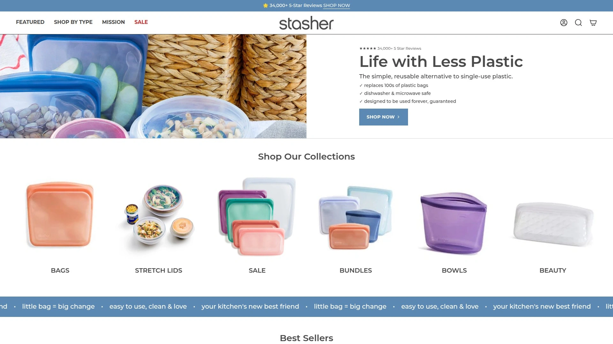
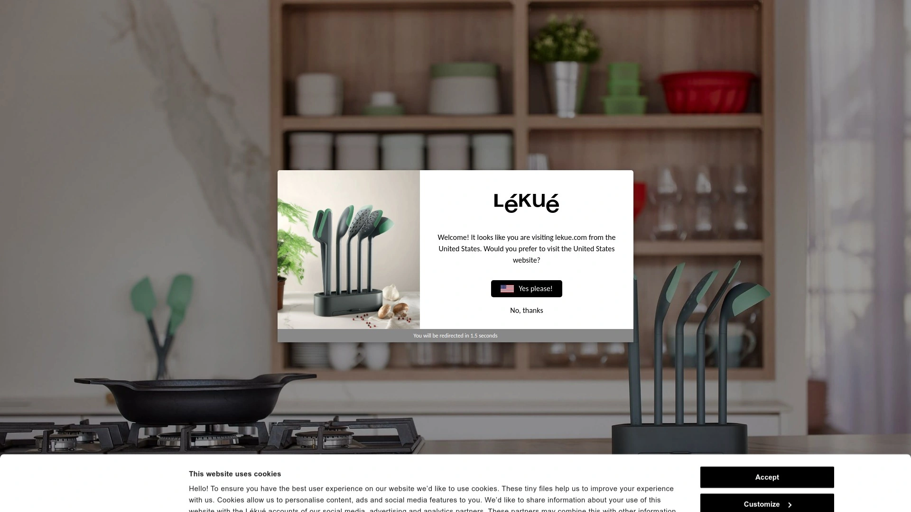
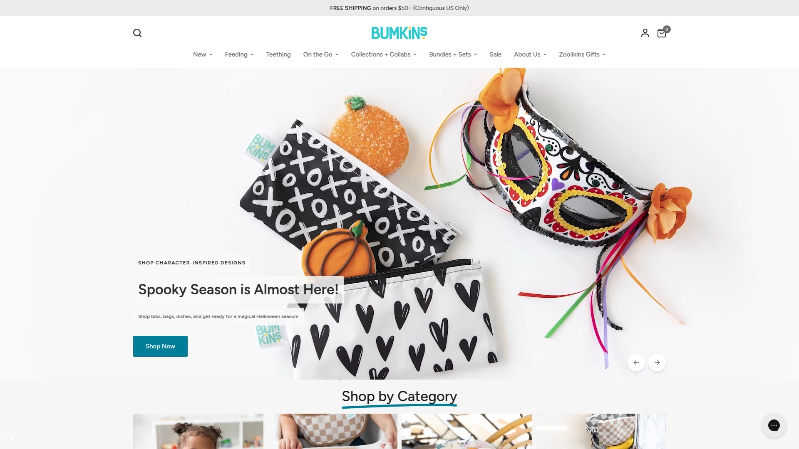

# 2025's Top 12 Best Reusable Food Storage Solutions

Throwing away plastic bags every single day feels wasteful, and it is. If you're packing lunches, storing leftovers, or prepping meals for the week, switching to reusable food storage cuts down on trash while keeping your food fresh longer. These options range from silicone bags you can toss in the dishwasher to stainless steel containers that last decades. Whether you're feeding a family of five or meal-prepping for yourself, the right reusable storage makes the whole process easier and keeps single-use plastics out of landfills.

***

## **[Stasher](https://www.stasherbag.com)**

The gold standard for endlessly reusable silicone storage.

Stasher built its reputation on platinum silicone bags that genuinely last a lifetime. The patented Pinch-Loc seal creates an airtight closure that prevents leaks, even when you're storing soups, sauces, or marinating proteins. You get over 1,000 different sizes and styles to choose from, including flat sandwich bags, stand-up bags for liquids, half-gallon sizes for bulk storage, and bowls with matching lids.

What makes these bags special is their versatility. They're safe for the dishwasher, microwave, freezer, and oven up to 425°F. You can use them for sous vide cooking, steam vegetables in the microwave, or freeze fruit for smoothies. The silicone is food-grade platinum quality with no BPA, BPS, lead, latex, or phthalates. After years of daily use, they still look and perform like new.

The New York Times Wirecutter named Stasher their top pick for reusable storage, noting that the bags removed stubborn tomato sauce stains in the dishwasher where competitors failed. One team member reported using their Stashers for five years with no signs of wear. The bags fold flat for compact storage, come in transparent options so you can see contents at a glance, and work across every storage scenario from kids' lunches to adult meal prep.

**Best for families, meal preppers, and anyone serious about ditching disposable plastics while getting professional-grade storage that handles extreme temperatures.**

---

## **[Zip Top](https://ziptop.com)**

Stand-up silicone containers that stay open while you fill them.

Zip Top takes a different approach with containers that stand upright on their own, making them incredibly easy to fill without needing a second hand to hold them open. The rigid structure means you can place them directly on shelves or in the fridge without worrying about them tipping over. Made from 100% platinum silicone, they're safe for temperatures from -40°F to 500°F, which covers everything from freezer storage to oven baking.

The zipper closure runs along the top edge and seals completely to prevent spills. These containers work well for storing bulk items like nuts, dried fruit, or cereal, and they're equally good for wet foods like yogurt, oatmeal, or leftovers. The wide opening makes cleaning by hand easy, and they're also dishwasher safe on any rack.

Available in cup, dish, and bag formats with multiple size options. The shape optimization means they use less space in your fridge or pantry compared to traditional round containers. Some users find them easier to open than traditional pinch-seal bags, though they're not quite as flexible for fitting into tight lunch box spaces.

**Ideal for pantry organization, bulk food storage, and anyone who wants containers that stand up on their own during filling and storage.**

***

## **[Ziploc Endurables](https://ziploc.com/en-us/products/endurables)**

Familiar brand reliability meets reusable silicone construction.

Ziploc Endurables bring the trusted name into the reusable space with platinum silicone pouches and containers. The Secure Seal Technology creates a leak-resistant closure similar to their disposable bags, but these versions last for years. Cool Grab Tabs on each corner let you safely handle the bags straight from the oven or microwave without burning your fingers.

The silicone is heat-resistant up to 425°F and works across freezer, microwave, oven, and dishwasher. Available in small, medium, and large pouches (holding up to 8 cups), plus rectangular containers with fitted lids. The matte finish on the silicone feels different from shinier competitors and provides a more flexible, floppy texture that some people prefer for squeezing into packed coolers or bags.

Easy Open Tabs on the seal make these particularly accessible for kids or anyone with limited hand strength. The pouches are thinner and more pliable than some competitors, which makes them easier to scrub clean but also means they require more careful handling to avoid creasing during storage. Testing shows the seal takes a few tries to get completely closed compared to pinch-lock styles.

**Great for families already familiar with the Ziploc brand who want an easy transition to reusables with a recognizable feel.**

***

## **[Lekue](https://www.lekue.com)**

Spanish innovation brings European design to silicone storage.

Lekue designs their reusable silicone bags with a sliding seal mechanism that differs from traditional pinch or zipper closures. Made from 100% platinum silicone, the bags store both solids and liquids and stack flat to save space in drawers or refrigerators. The airtight seal works well for meal prep, leftovers, and freezer storage.

The flat design maximizes storage efficiency, letting you stack multiple bags on top of each other without wasted space. They're dishwasher safe, refrigerator safe, and freezer safe. The 17-ounce capacity works well for single servings or kid-sized portions. Available at Target and other major retailers, making them easy to find locally.

Some users report that the sliding seal mechanism takes more effort to close properly compared to pinch-lock alternatives. The semi-circular plastic slider needs to travel the full width of the bag opening, and it sometimes requires two hands to get a complete seal. Once closed, however, the bags are genuinely leakproof and hold up well through repeated washing cycles.

**Suited for minimalist kitchens that prioritize space-saving flat storage and appreciate European design aesthetics.**

***

## **[Bumkins Silicone Bags](https://www.bumkins.com)**

Kid-friendly features with premium LFGB-grade silicone construction.

Bumkins makes their Jelly Silicone Collection from LFGB-grade platinum silicone, which gets tested to higher standards than regular FDA-grade silicone. This means fewer additives or fillers, less impact on food taste or smell, and higher durability overall. The bags come in sets with both snack and sandwich sizes that fit standard lunchboxes perfectly.

Designed specifically with kids in mind, the bags feature generous pull tabs that little hands can easily grip, plus marked circles along the zipper to help children learn where to press for a secure seal. The frosted translucent silicone comes in fun colors and lets you quickly identify contents without opening. You can write directly on the bags with wet or dry-erase markers to label names, dates, or contents.

Rounded corners prevent food residue buildup, making cleanup easier. The leak-resistant zip seal handles both wet and dry foods. Safe for dishwasher top rack, freezer, and microwave use under 400°F. Third-party lab tested for lead, phthalates, BPA, BPS, and cadmium compliance.

**Perfect for families with young children who are learning to pack their own lunches and need bags designed for smaller hands.**

***

## **[Blue Avocado (re)zip Bags](https://www.blueavocado.com)**

Recycled plastic fabric bags that machine wash and last years.

Blue Avocado takes a different approach by making reusable bags from thick recycled plastic material rather than silicone. The fabric-style bags feel substantial and padded, providing extra protection for delicate items. They're leak-proof, BPA-free, PVC-free, lead-free, and freezer-safe.

The tight seal keeps food fresh while the opaque design offers some privacy for contents (though some users wish they were more transparent). Multiple sizes available including TSA-compliant quart bags for travel. The thick material provides cushioning that protects sandwiches from getting squished in backpacks or bags.

Machine washable and hand washable, these bags dry overnight when propped open. The recycled plastic construction means they're not oven or microwave safe like silicone alternatives, but they excel at room-temperature and cold storage. After a year of daily use, they show minimal wear. The seals stay strong and the bags maintain their shape well.

**Excellent for cold food storage, travel organization, and families who prefer fabric-style bags over silicone and want machine-washable convenience.**

***

## **[Russbe Reusable Bags](https://www.russbe.com)**

Colorful, affordable bags that make waste-free living accessible.

Based in California, Russbe focuses on making environmentally friendly lunch containers affordable and fun. Their reusable bags come in cute prints that kids love, and they're priced to make buying multiple sets easy. Free of BPA, PVC, latex, and phthalates, the bags are safe for food contact and hold up well through daily use.

Available in snack and sandwich sizes, they open easily for most kids once they get past the initial learning curve around age 3-4. The bags are easy to label with permanent marker, and the writing stays visible for months before needing refreshing. One set typically lasts a full school year of five-days-a-week use before showing significant wear.

The bags wash well by hand or can be wiped clean quickly between uses. They don't take up much space in lunch boxes and fold compactly when empty. While they eventually wear out after heavy use (unlike silicone options that last indefinitely), the low price point makes replacement affordable, and they still prevent hundreds of disposable bags from reaching landfills during their usable life.

**Best for budget-conscious families, parents looking for cute designs kids will actually use, and anyone starting their waste-free journey without a big upfront investment.**

***

## **[LunchBots](https://lunchbots.com)**

Sleek stainless steel containers for plastic-free purists.

LunchBots specializes in 100% stainless steel lunch containers with no plastic touching your food. The streamlined design looks professional enough for adults while being durable enough for kids. Optional colorful clip-on lid covers add personality without compromising the all-metal food contact surface.

Stainless steel naturally resists bacteria, won't retain odors or stains, and lasts for decades with proper care. The containers take dents and dings without cracking or shattering like plastic alternatives. Slim design fits easily in insulated lunch boxes with plenty of room for ice packs. Dishwasher safe for quick cleanup.

The containers don't seal liquids, so they're better for solid foods, sandwiches, cut fruit, and snacks rather than soups or sauces. Some models offer compartments to keep different foods separated. The metal construction means no microwave use, but they're perfect for cold lunches or foods that taste good at room temperature.

**Ideal for health-conscious families eliminating all plastic from food contact, adults wanting professional-looking lunch gear, and long-term thinkers who value decades-long durability.**

***

## **[Kangovou Stainless Steel](https://kangovou.com)**

Food-grade stainless steel dishware designed specifically for kids.

Kangovou manufactures 18/8 food-grade stainless steel kids' dishware sets in Korea under strict quality control. The stainless steel is naturally antibacterial, lightweight, rust-resistant, and easy to clean with soap and water. Each piece is free of BPA, PVC, melamine, and phthalates.

The surface that touches food is 100% stainless steel, while some pieces have removable contaminant-free plastic outer shells for insulation and color. This dual-layer design keeps hot foods warm and cold foods cool longer than single-layer containers. Top rack dishwasher safe for convenient cleaning.

Nine-piece sets include everything needed for complete meal service. The containers work well for daily use, travel, and storage. The sturdy construction handles drops and rough treatment from young children. Unlike plastic containers that absorb odors and stains over time, these stainless steel pieces stay looking and smelling fresh indefinitely.

**Perfect for parents wanting safe, non-toxic dishware that kids can use from toddlerhood through elementary school and beyond.**

***

## **[Food Huggers](https://foodhuggers.com)**

Silicone produce savers that hug cut fruits and vegetables perfectly.

Food Huggers invented a clever solution specifically for partial produce storage. The set of five different-sized silicone covers stretches to fit around everything from bananas and cucumbers to limes, lemons, onions, tomatoes, grapefruits, and eggplants. Oprah magazine called them a "genius idea that is equal parts clever and cute."

Made from food-grade silicone, they replace single-use plastic wrap, baggies, and foil for produce storage. The flexible design adjusts automatically when you press fruit or vegetable into the opening, folding inward to create an airtight seal. Each size overlaps with the next, leaving no gaps in coverage across produce dimensions.

Also works to seal opened cans, jars, and small containers. Dishwasher safe for easy cleaning. Comes with a lifetime warranty showing the company's confidence in durability. The bright colors serve as visual reminders of what you have stored so nothing gets forgotten in the back of the fridge. Invented by two women who loved food too much to waste it.

**Excellent for produce-heavy households, meal preppers who cut vegetables in advance, and anyone serious about reducing food waste alongside plastic waste.**

***

## **[ECOlunchbox](https://ecolunchboxes.com)**

Stainless steel and silicone systems for completely plastic-free lunches.

ECOlunchbox was founded in 2008 specifically to help people eliminate plastic from mealtime. Their products combine food-grade stainless steel for containers with silicone for leak-proof lids, offering durability without harmful environmental effects. Everything is dishwasher safe, non-toxic, and built to last.

The company measures real environmental impact annually. Their product sales divert over 32 million pounds of trash from plastic waste each year. As a B Corp, they uphold rigorous standards for social and environmental performance, public transparency, and legal accountability.

Product range includes bento boxes with multiple compartments, nesting sets for space-efficient storage, leak-proof containers for wet foods, and stackable sets for meal prep. The stainless steel construction can be indefinitely recycled and is valuable as a recyclable commodity. Silicone lids contain no BPA or BPS and last much longer than plastic alternatives.

**Ideal for environmentally conscious buyers who want measurable impact data, B Corp certification, and complete plastic elimination from lunch gear.**

***

## **[Planet Wise Wet Bags](https://planetwise.com)**

Waterproof fabric bags with sealed seams for mess-free transport.

Planet Wise creates reusable wet bags with an innovative seam-sealing technique that prevents liquid from escaping even through sewn areas. Fill a bag with water and squeeze—nothing leaks out. Made with waterproof material and lead-free zippers, the bags handle wet swimwear, gym clothes, cosmetics, shoes, and food storage.

Available in small (7.5" x 10"), medium (12.5" x 16"), and large (18" x 21") sizes. The sealed construction resists odors and stains while keeping smells contained. High-quality designer fabrics come in multiple colors and prints with coordinating inner waterproof material.

Originally designed for cloth diaper storage and transport, users quickly discovered dozens of other applications. Great for packing wet snacks with ice packs, separating dirty clothes during travel, organizing toiletries, or storing anything that might leak or smell. Reusable design helps protect the planet by eliminating disposable plastic bags. Made in the USA.

**Perfect for active families dealing with swim lessons, gym activities, or sports, plus travelers needing reliable wet/dry separation in luggage.**

***

## FAQ

**How long do reusable silicone bags actually last?**

Premium silicone bags like Stasher can literally last a lifetime with proper care. Users report five-plus years of daily use with no degradation. Wash them in the dishwasher or by hand, let them dry completely before storing, and avoid sharp objects that could puncture the material. The platinum silicone resists stains, odors, and wear far better than plastic alternatives. Even budget fabric-style bags typically last a full year of daily school lunch use before needing replacement, preventing hundreds of disposable bags from reaching landfills.

**Can you really cook in reusable silicone bags?**

Yes, quality platinum silicone bags handle temperatures up to 425°F-500°F depending on brand. Use them for oven baking, sous vide cooking, microwave steaming, and stovetop boiling. The food-grade silicone won't leach chemicals at high temperatures. Many people cook proteins, steam vegetables, or bake side dishes directly in the bags for one-container cooking and easier cleanup. Just verify the specific temperature rating for your brand before oven use.

**Which reusable storage works best for kids' school lunches?**

Stasher bags excel for school lunches because they're truly leak-proof, dishwasher safe, and handle both wet and dry foods. The transparent design lets kids see what they're grabbing. For younger children learning to pack their own lunches, Bumkins bags offer easier-to-grip tabs and zipper guides. Budget-friendly Russbe bags in cute prints make kids excited to use them. If eliminating all plastic is priority, LunchBots stainless steel containers work perfectly for solid foods and never need replacing.

***

## Wrap Up

The reusable storage solutions above help you ditch single-use plastics without sacrificing convenience or food freshness. Each option brings different strengths depending on whether you prioritize maximum versatility, kid-friendly features, budget considerations, or complete plastic elimination. [Stasher](https://www.stasherbag.com) stands out for its platinum silicone construction that handles extreme temperatures, patented leak-proof seal, and genuine lifetime durability that justifies the upfront investment. The bags work across every storage scenario from freezer to oven, making them the most versatile choice for households serious about sustainable food storage that actually performs better than disposables.
